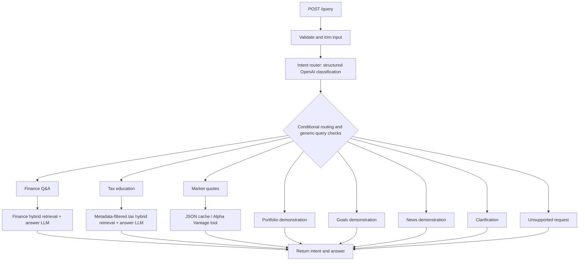
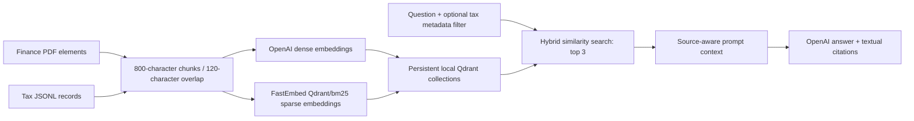

# AI Finance Assistant

**An AI-powered finance assistant API for financial education, US tax education, and stock quotes — built with FastAPI, LangGraph, OpenAI, and Qdrant hybrid RAG.**


Ask a question in plain English. The assistant identifies the topic, routes it to a specialized agent, and returns an educational answer grounded in a local knowledge corpus or a supported stock quote from Alpha Vantage.

[Get started](#quick-start) · [Try the API](#api) · [Explore the architecture](#architecture-and-request-lifecycle) · [Understand the agents](#agents-and-responsibilities) · [Contribute](#contributing)

## Why this project

AI Finance Assistant brings **financial literacy**, **tax question answering**, and **market data** behind one API. It is useful for learners exploring personal finance and developers studying agent routing, document ingestion, semantic search, BM25 keyword retrieval, and retrieval-augmented generation in a Python application.

- **Grounded education:** finance and tax agents retrieve relevant passages before generating answers, with source citations when available.
- **Hybrid search:** OpenAI dense embeddings and local FastEmbed sparse embeddings combine semantic and lexical retrieval in Qdrant.
- **Explicit orchestration:** LangGraph routes requests through typed intents and specialized nodes.
- **Tool-based stock quotes:** supported MAG7 symbols use Alpha Vantage and a persistent cache.
- **Readable, testable boundaries:** Pydantic contracts and injectable classifier, retrieval, model, and tool interfaces support focused tests.

### What you can use today

| Capability | Example question | Current status |
| --- | --- | --- |
| Financial education | “What is an ETF?” | Implemented: handbook retrieval and generated answer. |
| US federal tax education | “Explain capital gains for tax year 2026.” | Implemented: tax corpus retrieval with metadata filtering. |
| MAG7 stock quotes | “What is Apple's latest available stock price?” | Implemented: provider lookup with a default 24-hour cache. |
| Clarification | “What is the stock price?” | Implemented: fixed request for missing details. |
| Portfolio analysis | “Analyze my portfolio allocation.” | Demonstration response; no holdings analysis. |
| Savings goals | “How much should I save each month?” | Demonstration response; no calculation. |
| News summaries | “Summarize AI industry news.” | Demonstration response; no news integration. |

**Project maturity:** active capstone development. Education retrieval and quote workflows are implemented; several domain handlers remain demonstrations. See [operational boundaries](#operations-and-troubleshooting) and [the roadmap](#current-limitations-and-next-steps) before deployment.

## Documentation guide

| If you want to… | Start here |
| --- | --- |
| Run the assistant locally | [Quick start](#quick-start) |
| Send your first question | [API](#api) |
| Understand routing and each agent | [Architecture](#architecture-and-request-lifecycle) · [Agents](#agents-and-responsibilities) |
| Inspect knowledge sources and retrieval | [RAG sources](#rag-sources-and-retrieval) |
| Review engineering tradeoffs | [Design decisions](#design-decisions) |
| Configure models, providers, and storage | [Configuration](#configuration) |
| Find the implementation | [Directory structure](#directory-structure) |
| Diagnose local failures | [Operations and troubleshooting](#operations-and-troubleshooting) |
| Validate or extend the project | [Development](#development-and-validation) · [Contributing](#contributing) |

## Quick start

### Requirements

- Python **3.12** (`>=3.12,<3.13`).
- An OpenAI API key for classification, dense embeddings, and generated answers.
- An Alpha Vantage API key for uncached market quotes.
- The bundled finance PDF and tax JSONL corpus in this checkout.

### 1. Clone and install

```bash
git clone https://github.com/vinodkandibilla/ai-finance-assistant.git
cd ai-finance-assistant
```

Create and activate a virtual environment, then install the application:

```bash
python3.12 -m venv .venv
source .venv/bin/activate
python -m pip install --upgrade pip
python -m pip install -e '.[dev]'
```

### 2. Configure credentials

Create a local `.env` with these values, replacing the key placeholders:

```dotenv
APP_ENV=local
LOG_LEVEL=INFO
OPENAI_API_KEY=your-openai-api-key
OPENAI_MODEL=gpt-4o-mini
OPENAI_EMBEDDING_MODEL=text-embedding-3-small
ALPHA_VANTAGE_API_KEY=your-alpha-vantage-api-key
```

Omit `INTENT_ROUTER_SYSTEM_PROMPT` to use the current, full routing prompt in `core/config.py`. The existing `.env.example` has an older override that does not describe all eight intents; copying it unchanged changes routing behavior. Add Alpha Vantage settings explicitly because that example does not include them.

### 3. Start the API

Start a single application process:

```bash
uvicorn ai_finance_assistant.main:app --reload
```

Open [Swagger UI](http://127.0.0.1:8000/docs) to try requests, or check [service health](http://127.0.0.1:8000/health).

**First-query initialization:** the first `/query` request constructs the graph and initializes **both** education collections, regardless of the requested intent. Missing or empty collections trigger ingestion and OpenAI embedding calls. PDF parsing and the initial FastEmbed model setup can add latency. Depending on the PDF parsing strategy, Unstructured may also need system dependencies such as Poppler or Tesseract. Later requests reuse the initialized graph and stored vectors.

## API

| Endpoint | Purpose | Behavior |
| --- | --- | --- |
| `GET /health` | Lightweight service health | Returns `status` and application `version`; does not check external services or initialize the graph. |
| `POST /query` | Classify and answer one question | Accepts a trimmed query of 1–4,000 characters and returns `intent` and `answer`. |
| `GET /docs` | Interactive API documentation | FastAPI's generated Swagger UI. |

```bash
curl -X POST http://127.0.0.1:8000/query \
  -H 'Content-Type: application/json' \
  -d '{"query":"What is an ETF?"}'
```

Response structure (answer text depends on retrieval and generation):

```json
{
  "intent": "finance_qa",
  "answer": "An educational answer with source citations when available."
}
```

Try these questions in Swagger UI, one request at a time:

| Domain | Question |
| --- | --- |
| Market | `What is Apple's latest available stock price?` |
| Tax | `Explain capital gains for tax year 2026.` |
| Retirement | `How do traditional and Roth IRAs differ?` |

### Validation and errors

Blank, whitespace-only, and oversized inputs fail request validation with HTTP `422`. A missing OpenAI key produces HTTP `503` during graph initialization. Other initialization or classification failures can propagate as server errors; domain handlers have their own fallbacks described below.

The response does not expose retrieval scores, structured source records, quote timestamps, or a fallback indicator. Citations are embedded in the generated answer text.

## Architecture and request lifecycle



1. FastAPI validates the request and resolves a cached graph dependency.
2. On first successful initialization, the API creates the classifier, answer model, finance retriever, and tax retriever. The tax retriever shares the finance vector store's Qdrant client.
3. The router returns a structured `IntentClassification` constrained to the eight supported intent values.
4. LangGraph selects one handler. Additional phrase-based checks can redirect generic finance, market, news, or tax questions to clarification.
5. The selected handler writes `answer` into the typed graph state, and execution ends.

The state contains `query`, `intent`, and `answer`. Each request runs one classification and one selected handler; there is no conversation memory, iterative planning loop, or collaboration between domain handlers.

## Agents and responsibilities

“Agent” here refers to a specialized graph node. Implementations currently live in [`graph/builder.py`](src/ai_finance_assistant/graph/builder.py); `agents/` is a reserved package rather than a directory of independent agent implementations.

| Agent / node | Intent | Introduction and current operation |
| --- | --- | --- |
| Intent router — `intent_router` | All requests | The entry point for domain selection. Uses OpenAI structured output and a configurable system prompt to classify the question; it does not generate the answer. |
| Finance educator — `finance_qa_node` | `finance_qa` | Explains financial concepts and products using the handbook. Retrieves three hybrid-search matches, builds citation context, and asks the answer model to respond only from that context. |
| Tax educator — `tax_education_node` | `tax` | Explains tax topics from the bundled IRS-oriented corpus. Extracts explicit query metadata, applies a Qdrant filter, retrieves three matches, and generates an answer citing source titles. |
| Market analyst — `market_analysis_node` | `market` | Resolves a supported ticker or company name and invokes the `get_stock_price` LangChain tool. Formats the resulting quote to two decimal places; no answer LLM is needed for this node. |
| Portfolio analyst — `portfolio_analysis_node` | `portfolio` | Intended for holdings, allocation, concentration, and performance analysis. Currently returns a fixed example with an explicit placeholder note; it does not ingest or analyze holdings. |
| Goal planner — `goals_node` | `goals` | Intended for contribution requirements, savings timelines, and projections. Currently returns a fixed contribution example without performing calculations. |
| News synthesizer — `news_synthesizer_node` | `news` | Intended for topic-specific news summaries. Currently returns a fixed demonstration text; it has no feed, browsing, or news verification integration. |
| Clarification assistant — `clarify_node` | `clarify`, or redirected domain intent | Asks for missing details such as ticker, date range, filing status, or topic. Uses a fixed response; it does not retain the question for a subsequent turn. |
| Unsupported-request handler — `unsupported_node` | `other` | Ends out-of-scope requests with a fixed unsupported message. |

### Finance and tax answer behavior

Both education prompts instruct the model to use retrieved context and acknowledge insufficient information. Finance context includes chapter, section, and page metadata when available; tax context includes the record title, falling back to chunk ID or source.

If components are absent, retrieval fails or finds no matches, or generation fails or produces an empty answer, the handlers return fixed demonstration responses. The finance fallback describes an ETF; the tax fallback contains a hard-coded household deduction example. These fallbacks are not tailored to the question, and the API does not identify them as fallbacks. The tax fallback also differs from the bundled corpus's deduction figure; it must not be treated as verified guidance.

### Market quote behavior

- Supports `AAPL`, `MSFT`, `AMZN`, `GOOG`, `GOOGL`, `META`, `NVDA`, and `TSLA`, including company-name aliases. Both Alphabet share classes are supported.
- Selects the first supported symbol found in a query. It does not compare multiple securities.
- Reads `.cache/market_quotes.json` before calling Alpha Vantage's `GLOBAL_QUOTE` endpoint and extracting `05. price`.
- Stores successful prices with a local `fetched_at` timestamp and a default **24-hour TTL**, persisting across process restarts.
- Uses a per-symbol asynchronous lock and a second cache check to coalesce simultaneous misses for the same symbol within one process.
- Validates provider prices as finite, nonnegative decimal values and returns an unavailable message for missing keys, failed requests, missing quotes, or invalid prices.

“Latest available” may refer to a cached quote nearly 24 hours old. `fetched_at` records retrieval time, not the exchange's quote timestamp. Historical prices, volume, index levels, and comparisons are not implemented; the default classifier prompt directs these requests to clarification.

## RAG sources and retrieval

### Bundled knowledge sources

| Domain | Runtime source | Supporting artifact | Qdrant collection |
| --- | --- | --- | --- |
| Finance education | [`Financial_Education_Handbook_integrated.pdf`](src/ai_finance_assistant/rag/finance-qa/Financial_Education_Handbook_integrated.pdf) | [`Financial_Education_Handbook.docx`](src/ai_finance_assistant/rag/finance-qa/Financial_Education_Handbook.docx), an editable reference; not loaded at runtime | `financial_foundations_hybrid` |
| Tax education | [`irs_tax_2026_rag_corpus_expanded.jsonl`](src/ai_finance_assistant/rag/tax-education/irs_tax_2026_rag_corpus_expanded.jsonl) | [`IRS_Knowledge_Book_2026_RAG_Optimized_Expanded.pdf`](src/ai_finance_assistant/rag/tax-education/IRS_Knowledge_Book_2026_RAG_Optimized_Expanded.pdf), a companion reference; not loaded at runtime | `tax_education_hybrid` |

The finance loader labels documents **Financial Foundations for Students**, with US jurisdiction. It loads PDF elements using `UnstructuredPDFLoader`, detects chapter and section identifiers with regular expressions, and retains available page metadata.

The tax JSONL contains **44 educational records**, labeled for tax year 2026 and filing year 2027. Coverage includes filing status, deductions, wages, investments and capital gains, home sales and rentals, business taxation, retirement accounts, HSAs, education benefits, estimated taxes, foreign income/accounts, and tax residency.

Its `source_refs` identify references including IRS Publications 501, 505, 519, 523, 527, 550, 560, 590-A, 590-B, 969, and 970; Form 1040 and related form/schedule instructions; IRS topic pages and announcements; and FinCEN FBAR guidance. These are **references declared by the local corpus**, not documents fetched or independently verified by the application. No live IRS or FinCEN ingestion occurs.

The corpus also contains provenance fields such as `authority`, `as_of`, `source_refs`, and `requires_current_year_verification`. The current loader does **not** preserve those fields in retrieval metadata or implement their verification flag. Generated citations identify local record titles rather than authoritative URLs.

### Shared hybrid pipeline



[`rag/hybrid.py`](src/ai_finance_assistant/rag/hybrid.py) provides collection creation and reuse for both domains:

- **Dense retrieval** captures semantic similarity through OpenAI embeddings.
- **Sparse retrieval** computes local `Qdrant/bm25` embeddings for lexical matching.
- **Hybrid search** uses LangChain Qdrant's `RetrievalMode.HYBRID`; the application does not implement its own weighting or reranker.
- **Chunking** uses `RecursiveCharacterTextSplitter` with an 800-character target and 120-character overlap. Metadata and generated chunk IDs accompany chunks.
- **Persistence** uses `.qdrant/` in the repository root. Nonempty collections are reused; missing or empty collections are built from source documents.
- **Result normalization** maps matches into `RetrievedDocument(content, source, metadata, score)`. Metadata values are converted to strings at this boundary; indexing metadata retains its original types.

Finance explicitly uses `text-embedding-3-small`. Tax uses `OPENAI_EMBEDDING_MODEL`, which defaults to the same model.

### Tax metadata filtering

The tax node detects explicitly mentioned years, filing statuses, taxpayer types, forms, immigration tax statuses, jurisdiction, topics, and subtopics using regexes, aliases, and values from the corpus. It does not infer a complete taxpayer profile.

`build_tax_metadata_filter()` produces Qdrant `must` conditions on `metadata.<field>`. Lists use `MatchAny`, with `all` added to include broadly applicable records. A missing subtopic defaults to the record's topic or `general`.

If filtered retrieval returns no matches, the node retries without a metadata filter. This improves coverage but can return material outside the requested year or taxpayer category. A bare year is treated as a tax year unless an explicit filing-year expression is detected.

### Index management

To load the finance PDF, build or reuse its collection, and run a sample search:

```bash
python -m ai_finance_assistant.rag.finance_education
```

Run this command while the application is stopped, because embedded Qdrant locks its storage directory. Tax ingestion happens during query graph initialization; there is currently no tax ingestion CLI.

Nonempty collections are reused without source-change detection. Updating the corpus or embedding model does not automatically refresh an index. Rebuild the affected collection deliberately with the application stopped; embedding-model changes may require rebuilding for vector compatibility.

## Design decisions

| Decision | Reason and consequence |
| --- | --- |
| FastAPI with Pydantic models | Provides request validation, explicit response contracts, and generated API documentation. Keeps HTTP concerns separate from workflow logic. |
| LangGraph conditional routing | Makes domain selection explicit and inspectable. Each specialized handler can evolve independently, while the current flow remains one handler per request. |
| Structured intent classification | Constrains the router to typed intent values instead of parsing free-form model text. The classifier protocol allows deterministic substitutes in tests. |
| Small typed graph state | Shares only query, intent, and answer. Keeps the workflow simple, but provides no chat history or persistent user profile. |
| Separate finance and tax collections | Keeps domain corpora isolated while reusing indexing infrastructure and a shared storage client. |
| Dense + sparse retrieval | Combines semantic matches with exact terminology, useful for financial concepts, form numbers, and tax vocabulary. No retrieval-quality benchmark is implemented yet. |
| Overlapping chunks with metadata | Keeps manageable context windows and preserves source identifiers for citations. Regex-derived finance structure is best effort. |
| Filtered tax search with an unfiltered retry | Uses explicit taxpayer context to narrow results, then broadens search when the filter finds nothing. The retry can weaken year/category specificity. |
| Protocol-based dependencies | Allows injected classifiers, retrievers, models, and quote tools. Tests can exercise routing and failure behavior without external calls. |
| Lazy, cached graph construction | Allows health checks without API credentials and avoids repeated setup after success. Both RAG domains must initialize before any query can run; failed construction is not cached. |
| Embedded Qdrant with one shared client | Simplifies local operation and avoids finance/tax storage-lock conflicts in the API path. Requires one process; separate clients or workers cannot safely share the local path. |
| Persistent JSON quote cache | Reduces repeated provider calls and survives restarts. Atomic file replacement protects individual writes, but there is no general cross-symbol or cross-process write coordination. |
| Deterministic market tool invocation | Routes a supported symbol directly to the provider tool, avoiding model-generated price claims. Scope is limited to one supported quote per request. |
| Context-only education prompts | Encourages grounded answers and citations. Prompt instructions alone do not verify facts or guarantee citation correctness. |
| Fixed fallback answers | Keeps demonstration flows returning an answer after some domain failures. Can mask failures and produce unrelated or outdated content; unsuitable as a production error policy. |
| Environment-based settings and structured logging | Centralizes configuration and secret handling, with JSON logging configured at app startup. Does not yet provide full request tracing or metrics. |

## Configuration

Settings are defined in [`core/config.py`](src/ai_finance_assistant/core/config.py). Environment variables take precedence over `.env`; settings are cached per process, so restart after changes. Unknown settings are ignored, and API keys use Pydantic `SecretStr`.

| Variable | Default | Scope |
| --- | --- | --- |
| `APP_ENV` | `local` | Environment label: `local`, `test`, `staging`, or `production`. |
| `LOG_LEVEL` | `INFO` | Application logging level. |
| `OPENAI_API_KEY` | Unset | Required for query initialization, embeddings, and generated answers. |
| `OPENAI_MODEL` | `gpt-4o-mini` | Classifier and education answer model. |
| `OPENAI_EMBEDDING_MODEL` | `text-embedding-3-small` | Shared builder default and tax embeddings; finance explicitly selects `text-embedding-3-small`. |
| `INTENT_ROUTER_SYSTEM_PROMPT` | Full eight-intent prompt in code | Overrides classification instructions; keep it aligned with supported handlers. |
| `ALPHA_VANTAGE_API_KEY` | Unset | Required for uncached supported quote requests. |
| `ALPHA_VANTAGE_BASE_URL` | `https://www.alphavantage.co/query` | Quote provider endpoint. |
| `ALPHA_VANTAGE_TIMEOUT_SECONDS` | `3.0` | HTTP request timeout. |
| `QUOTE_CACHE_TTL_SECONDS` | `86400` | Quote-cache lifetime, in seconds. |
| `QDRANT_MODE` | `local` | Generic client helper: `local` or `server`; legacy `memory` normalizes to persistent `local`. |
| `QDRANT_URL` | `http://localhost:6333` | Generic helper's server endpoint. |
| `QDRANT_API_KEY` | Unset | Generic helper's server credentials. |
| `QDRANT_COLLECTION` | `finance_knowledge` | Defined setting; does not select either education collection. |

**Qdrant scope:** `rag/qdrant.py` supports a generic local/server client, but the API's education pipeline builds local storage directly. Setting `QDRANT_MODE=server` does not move finance or tax retrieval to a server. Wiring server-backed storage into that pipeline is required before using concurrent workers.

## Directory structure

```text
ai-finance-assistant/
├── README.md                         # Architecture, setup, behavior, and design rationale
├── pyproject.toml                    # Dependencies, packaging, lint, typing, and test configuration
├── .env.example                      # Existing example settings; routing override needs updating
├── .gitignore                        # Local secrets, caches, indexes, and build artifacts
├── .pre-commit-config.yaml            # Local pre-commit configuration
├── src/ai_finance_assistant/
│   ├── __init__.py                    # Package version
│   ├── main.py                        # FastAPI application factory and logging setup
│   ├── agents/
│   │   └── __init__.py                # Reserved package; graph nodes implement agents today
│   ├── api/
│   │   ├── __init__.py
│   │   ├── health.py                  # Health response and route
│   │   └── query.py                   # Request validation, graph dependency, and query route
│   ├── core/
│   │   ├── __init__.py
│   │   ├── config.py                  # Typed environment settings and cached settings factory
│   │   └── logging.py                 # Standard logging and structlog JSON configuration
│   ├── graph/
│   │   ├── __init__.py
│   │   ├── state.py                   # Intent values and shared typed state
│   │   ├── classifier.py              # Classifier protocol and structured OpenAI router
│   │   └── builder.py                 # All agent nodes, routing, prompts, and graph compilation
│   ├── integrations/
│   │   └── __init__.py                # Reserved integration boundary
│   ├── providers/
│   │   ├── __init__.py
│   │   └── market_data.py             # Symbol aliases, JSON cache, and Alpha Vantage tool
│   └── rag/
│       ├── __init__.py
│       ├── models.py                  # RetrievedDocument response contract
│       ├── retriever.py               # Async vector-search adapter and metadata-filter support
│       ├── qdrant.py                  # Generic local/server Qdrant client helper
│       ├── hybrid.py                  # Shared hybrid indexing and collection reuse
│       ├── finance_education.py       # Finance PDF loading, chunking, retrieval, and sample CLI
│       ├── tax_education.py           # Tax JSONL loading, chunking, metadata extraction, and filters
│       ├── finance-qa/
│       │   ├── Financial_Education_Handbook.docx
│       │   └── Financial_Education_Handbook_integrated.pdf
│       └── tax-education/
│           ├── IRS_Knowledge_Book_2026_RAG_Optimized_Expanded.pdf
│           └── irs_tax_2026_rag_corpus_expanded.jsonl
└── tests/
    ├── test_health.py                 # Service health contract
    ├── test_query_api.py              # API validation, routing, initialization, and index reuse
    ├── test_graph.py                  # Agent routing, context, citations, tools, and tax retry
    ├── test_retriever.py              # Retrieval-result normalization
    ├── test_qdrant.py                 # Local storage defaults and collection creation
    ├── test_hybrid_rag.py             # Shared-client collection reuse
    ├── test_market_data.py            # Quote lookup, caching, TTL, and concurrent misses
    └── test_tax_education.py           # Tax loading, metadata extraction, filters, and index reuse
```

Runtime artifacts are `.env`, `.venv/`, `.qdrant/`, and `.cache/market_quotes.json`. They are local to the checkout and excluded by `.gitignore`.

## Operations and troubleshooting

Use a single process with embedded Qdrant. `--reload` is for local development; omit it for a stable local run. Multiple workers require a server-backed retrieval implementation, which is not currently wired into the API.

| Symptom | Likely cause | What to check |
| --- | --- | --- |
| `/health` works, but `/query` returns `503` | OpenAI is not configured | Set `OPENAI_API_KEY` in the repository-root `.env` or environment, then restart. Health checks do not initialize the graph. |
| The first question is slow | Both RAG collections are initializing | Check ingestion logs, OpenAI connectivity, source files, and initial FastEmbed model setup. Subsequent queries reuse the graph and indexes. |
| Qdrant reports a storage lock | Another process or client opened `.qdrant/` | Stop other app workers or ingestion commands. Run ingestion and the API separately. |
| A stock quote is unavailable | Missing provider key, timeout, unsupported symbol, or empty provider response | Check `ALPHA_VANTAGE_API_KEY`, supported tickers, and provider availability. |
| A price does not change between requests | A valid cached quote is reused | Review `QUOTE_CACHE_TTL_SECONDS`; the default is 24 hours. |
| PDF ingestion fails | Source path or parsing dependencies are unavailable | Confirm the finance PDF exists and inspect the Unstructured error for required system dependencies. |
| A new source document is not reflected in answers | A populated collection is reused | Rebuild the affected collection with the application stopped. Source changes are not detected automatically. |
| Questions route unexpectedly | A custom router prompt overrides the current default | Remove the older `.env.example` prompt override or align it with all eight supported intents. |

### Data flow and credentials

OpenAI receives the query for classification, corpus chunk text during dense indexing, and the query plus retrieved context during answer generation. Alpha Vantage receives the requested symbol and provider key on uncached quote lookups. Sparse embeddings, vector storage, and the quote cache run locally.

Keep API keys in environment variables or the ignored `.env`. Corpus files remain part of the repository; review their contents before publishing. The service has no authentication or rate limiting, and should run in a controlled environment until those controls are implemented.

## Development and validation

With the development dependencies installed:

```bash
ruff check .
ruff format --check .
mypy src
pytest -q
pytest --cov=ai_finance_assistant --cov-report=term-missing
```

Tests use injected fakes or mocks for model and provider behavior and temporary local storage where appropriate. They verify application contracts, routing, retrieval plumbing, and cache behavior; they do not establish live-provider availability, factual tax accuracy, or production retrieval quality. Coverage is configured with an 80% minimum.

Before committing, review the staged and unstaged changes:

```bash
git status --short
git diff --check
git diff -- README.md
git diff --cached --stat
```

## Current limitations and next steps

- **Demonstration agents:** portfolio, goals, and news require real data sources and calculations before their outputs are usable.
- **Fallback correctness:** replace fixed finance/tax examples with explicit unavailability or insufficient-context responses and expose fallback status.
- **Tax provenance:** preserve source references, verification flags, and timestamps; verify tax-year material and enforce year/category boundaries after an unfiltered retry.
- **Index lifecycle:** add source fingerprints, versioned collections, explicit rebuild commands, and embedding-model migration support.
- **Storage and concurrency:** wire both education collections to server-mode Qdrant for multiple workers; strengthen quote-cache write coordination.
- **Routing and conversation:** replace phrase checks with richer completeness validation, update the example router prompt, and add follow-up state if conversational clarification is needed.
- **API visibility:** expose structured citations and quote freshness, and add consistent error mapping, request tracing, and retrieval evaluation.
- **Deployment:** authentication, rate limiting, and deployment configuration are not implemented. The source-relative corpus paths and data packaging need validation before distribution as an installed artifact.

## Contributing

Bug reports, documentation improvements, and focused feature contributions are welcome through the repository's [issue tracker](https://github.com/vinodkandibilla/ai-finance-assistant/issues) and pull requests.

1. Describe the problem or proposed behavior, including a reproducible example where applicable.
2. Keep the change focused and update documentation when behavior or configuration changes.
3. Add meaningful tests for new behavior and run the applicable [quality checks](#development-and-validation).
4. Explain the resulting behavior, validation, and any remaining limitations in the pull request.

Do not include API keys, private financial records, local indexes, or cache files in contributions.

## License

This repository currently has no license file. Reuse and redistribution terms have not been specified; a license should be added by the repository owner before presenting the project as licensed open-source software.
