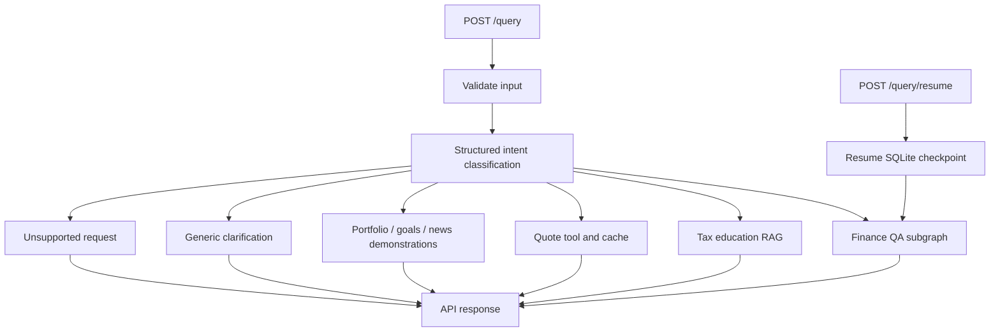
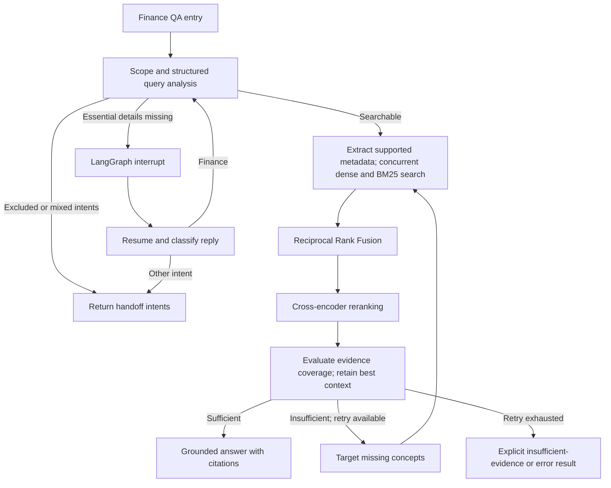

# AI Finance Assistant

**Investment education with an agentic LangGraph RAG workflow, alongside US tax education and market quotes—served through one FastAPI API.**


Ask an investing question in plain English. Finance QA searches a financial handbook, checks whether the evidence covers the whole question, and makes at most one targeted retrieval retry before returning a cited answer or an explicit evidence limitation.

[Quick start](#quick-start) · [API](#api) · [Architecture](#architecture) · [Finance QA](#finance-qa-agentic-rag) · [Configuration](#configuration) · [Development](#development)

## Capabilities

| Capability | Example | Implementation |
| --- | --- | --- |
| Investment education | “Explain NAV versus market price for an ETF.” | Finance QA LangGraph subgraph with dense/BM25 retrieval, RRF, cross-encoder reranking, evidence evaluation, and citations. |
| Concept comparisons | “What is the difference between buying QQQ and tracking the Nasdaq-100?” | Up to three dense subqueries and a shared lexical search; evaluates combined evidence coverage. |
| Options education | “How do Delta and Theta affect a call option?” | Handbook-grounded explanations; missing evidence can trigger one retry. |
| Finance clarification | “Which is better?” | Interrupts retrieval for essential missing details; supports a checkpointed reply through `/query/resume`. |
| US tax education | “Explain capital gains for tax year 2026.” | Separate metadata-filtered hybrid RAG over the bundled tax JSONL corpus. |
| Market quotes | “What is Apple's latest available stock price?” | Alpha Vantage quote lookup for supported MAG7 symbols with a persistent cache. |
| Portfolio, goals, news | Holdings analysis, savings projections, news summaries | Fixed demonstration responses; these integrations and calculations are not implemented. |

The project is in active development. Finance QA is implemented, but the complete application is not production-ready. The operational limitations below describe the current code, including differences from the [Finance Agentic RAG coding prompt](resources/prompts/Finance_Agentic_RAG_Coding_Agent_Prompt.md).

## Quick start

### Requirements

- Python **3.12** (`>=3.12,<3.13`).
- An OpenAI API key for routing, embeddings, query analysis, evaluation, and generated answers.
- An Alpha Vantage API key if you want uncached market quotes.
- The bundled finance PDF and tax JSONL sources in this checkout.
- Network access for provider calls and initial FastEmbed/cross-encoder model downloads.

### Install

```bash
git clone https://github.com/vinodkandibilla/ai-finance-assistant.git
cd ai-finance-assistant
python3.12 -m venv .venv
source .venv/bin/activate
python -m pip install --upgrade pip
python -m pip install -e '.[dev]'
```

Create `.env` in the repository root:

```dotenv
APP_ENV=local
LOG_LEVEL=INFO
OPENAI_API_KEY=your-openai-api-key
OPENAI_MODEL=gpt-4o-mini
OPENAI_EMBEDDING_MODEL=text-embedding-3-small
ALPHA_VANTAGE_API_KEY=your-alpha-vantage-api-key
QDRANT_MODE=local
FINANCE_COLLECTION=finance_education_dense
FINANCE_QUERY_ANALYSIS_MODEL=gpt-4o-mini
FINANCE_CHECKPOINT_PATH=.cache/finance_agent_checkpoints.sqlite
```

Use the default router prompt in `core/config.py`. The current `.env.example` contains an older `INTENT_ROUTER_SYSTEM_PROMPT` override that omits tax, news, and clarification intents. Remove that override if you copy the example.

### Run

```bash
uvicorn ai_finance_assistant.main:app --reload
```

Open [Swagger UI](http://127.0.0.1:8000/docs) or [service health](http://127.0.0.1:8000/health).

The first query constructs the cached parent graph and initializes both retrieval domains. New collections require embedding calls; Finance QA builds an in-memory BM25 index. The cross-encoder loads when reranking is first needed. Health checks do not initialize these dependencies or verify provider availability.

## API

| Endpoint | Purpose |
| --- | --- |
| `GET /health` | Returns service status and version. |
| `POST /query` | Classifies and processes a new question. |
| `POST /query/resume` | Supplies a reply to a checkpointed Finance QA clarification. |
| `GET /docs` | Interactive request and response documentation. |

### Ask a question

```bash
curl -X POST http://127.0.0.1:8000/query \
  -H 'Content-Type: application/json' \
  -d '{"query":"Explain NAV versus market price for an ETF."}'
```

Illustrative successful response; generated text and source identifiers vary:

```json
{
  "intent": "finance_qa",
  "answer": "An explanation grounded in the retrieved handbook passages, with page citations.",
  "citations": ["Financial Education Handbook, page 12 (<document-id>)"]
}
```

`intent` and `answer` are always present. Optional fields are omitted when absent:

| Field | Meaning |
| --- | --- |
| `status` | Exposes `clarification`, `handoff`, `insufficient`, or `error` when applicable. Successful `answered` status is omitted by the API. |
| `citations` | Strings identifying selected handbook pages and document IDs. These describe selected context; they are not a verified mapping from claims to sources. |
| `thread_id` | Checkpoint identifier returned when a clarification is pending. |
| `clarification_question` | The information needed before retrieval can proceed. |
| `handoff_intents` | Destination intents detected by Finance QA; the parent currently returns them without dispatching another handler. |

### Resume a clarification

A Finance QA interrupt returns a response such as:

```json
{
  "intent": "finance_qa",
  "answer": "",
  "status": "clarification",
  "thread_id": "<returned-thread-id>",
  "clarification_question": "Which investment products would you like to compare?"
}
```

```bash
curl -X POST http://127.0.0.1:8000/query/resume \
  -H 'Content-Type: application/json' \
  -d '{"thread_id":"<returned-thread-id>","reply":"ETFs and mutual funds."}'
```

The finance clarification node reclassifies the reply using the shared intent classifier. A finance reply is combined with the original question for search and reanalysis; a different intent produces a handoff. The parent graph's router node is not re-entered. Generic top-level clarification responses do not create this resumable workflow.

New query inputs and resume replies are trimmed and constrained to 1–4,000 characters. Invalid input returns HTTP `422`; an absent OpenAI key produces HTTP `503` during graph construction. Other initialization and unhandled execution failures can become server errors. Unknown or expired thread IDs do not have a dedicated HTTP error contract yet.

## Architecture

The parent LangGraph routes eight intents: `finance_qa`, `tax`, `market`, `portfolio`, `goals`, `news`, `clarify`, and `other`.



The parent embeds `FinanceQaAgent.graph` as `finance_qa_node` and compiles with a SQLite checkpointer. Parent state includes the query, intent, answer, and Finance QA retrieval/evaluation/result fields. Each new request receives a UUID thread ID; only pending clarifications expose that ID through the API.

The finance child performs iterative evidence retrieval. Other domain handlers remain separate routes; there is no implemented mixed-intent execution plan or persistent user financial profile.

## Finance QA agentic RAG

### Scope and knowledge source

Finance QA covers general investment education: stocks, bonds, ETFs, mutual funds, index funds, benchmarks, market terminology, options mechanics and Greeks, diversification, volatility, allocation, and other investing risk concepts.

Retirement accounts, tax and immigration topics, live prices, breaking news, personalized portfolio/planning requests, trades, and account actions are excluded from its education prompt. Deterministic rules hand retirement/tax/immigration requests to `tax`, live quote requests to `market`, and certain trade requests to `portfolio`; structured query analysis handles further intent detection. These are routing destinations, not guarantees that the destination implements the requested action.

The authoritative finance source is the bundled [Financial Education Handbook PDF](src/ai_finance_assistant/rag/finance-qa/Financial_Education_Handbook_integrated.pdf). The companion DOCX is not loaded. Finance QA does not retrieve from the tax corpus or the web.

Ingestion extracts text page by page, discards pages matching tax, retirement, or immigration exclusion patterns, and chunks the remaining pages with an **800-character target and 120-character overlap**. Page-level exclusion can remove otherwise useful investment material from mixed-topic pages.

Each chunk retains source path, document title, 1-based page number, inferred chapter/section, chunk ID, and a SHA-256 document ID. The ID includes the source path and content, so moving the checkout can change IDs.

### Workflow



1. **Analyze:** one structured LLM call identifies intent, completeness, complexity, lexical terms, and up to three dense subqueries. Analysis failure falls back to the original query and deterministic keywords, after the deterministic scope checks.
2. **Extract metadata:** optional hard filters use only explicit values supported by loaded corpus metadata. The current PDF adapter supplies provenance fields rather than topic/ticker taxonomy, so optional financial filters are normally absent.
3. **Retrieve concurrently:** each dense subquery searches Qdrant; one `rank_bm25` search uses combined keywords over the PDF chunks. Dense searches have bounded concurrency and per-search timeouts; BM25 runs in a worker thread.
4. **Fuse:** each ranked list contributes `1 / (60 + rank)`, starting at rank 1. Repeated document IDs contribute across lists; fused output is deduplicated. Raw vector and BM25 scores are not combined.
5. **Rerank:** `cross-encoder/ms-marco-MiniLM-L-6-v2` scores the original question against up to 20 candidates and retains five by default. Model loading and scoring run in a worker thread.
6. **Evaluate:** a separate structured LLM call judges whether the selected passages cover the complete question, returning a sufficiency flag, heuristic score, missing concepts, suggested queries, and reason. The score is not a probability or calibrated threshold.
7. **Retry once:** insufficient coverage can trigger one reformulation and a second retrieval/evaluation attempt. Sufficient evidence beats insufficient evidence; otherwise the current context replaces the prior one only when its score improves by more than the default `0.08` tolerance.
8. **Generate:** sufficient evidence produces an answer from the original question and selected passages. Without sufficient evidence, the agent returns an explicit limitation rather than generating a partial educational answer.

BM25 tokenization case-folds text and preserves internal hyphens, periods, and slashes, including terms such as `Nasdaq-100`. Both channels begin from the same extracted chunks when a collection is first built. If a retrieval channel fails, surviving results remain usable and a warning is logged. Empty evidence, evaluator failure, and generation failure have controlled results; reranker exceptions are not currently caught by the child graph.

## Other agents and retrieval

### Tax education

Tax retrieval uses [the bundled IRS-oriented JSONL corpus](src/ai_finance_assistant/rag/tax-education/irs_tax_2026_rag_corpus_expanded.jsonl), separately from Finance QA. OpenAI dense embeddings and FastEmbed `Qdrant/bm25` sparse embeddings are stored in `tax_education_hybrid` and queried through LangChain Qdrant hybrid retrieval.

The tax handler extracts explicit metadata such as years, filing status, forms, and topics, retrieves three matches, and generates an answer citing local record titles. A filter with no matches triggers an unfiltered retry, which can weaken year/category specificity. Retrieval or generation failures return a fixed tax example without a fallback indicator.

The corpus declares IRS/FinCEN references and verification metadata; the app does not fetch those sources or independently verify current rules. The loader does not retain every provenance/verification field. The companion tax PDF is a reference artifact, not a runtime source.

### Market quotes

The market handler supports `AAPL`, `MSFT`, `AMZN`, `GOOG`, `GOOGL`, `META`, `NVDA`, and `TSLA`, including company-name aliases. It selects the first supported symbol and uses a LangChain tool for Alpha Vantage `GLOBAL_QUOTE` retrieval.

Successful quotes persist in `.cache/market_quotes.json` with a default **24-hour TTL**. Per-symbol async locks coalesce concurrent cache misses within one process. Prices are validated as finite, nonnegative decimals. Missing keys, failed requests, or invalid quotes return an unavailable message.

“Latest available” can mean a cached quote almost 24 hours old. The cache timestamp records local retrieval time, not exchange quote time. Historical prices, volume, index levels, and comparisons are not implemented.

## Configuration

Application settings load from `.env` and environment variables through [`core/config.py`](src/ai_finance_assistant/core/config.py).

| Variable | Default | Purpose |
| --- | --- | --- |
| `OPENAI_API_KEY` | Unset | Required provider credential. |
| `OPENAI_MODEL` | `gpt-4o-mini` | Parent classifier and tax answer model. |
| `OPENAI_EMBEDDING_MODEL` | `text-embedding-3-small` | Dense embeddings for both domains. |
| `INTENT_ROUTER_SYSTEM_PROMPT` | Built-in eight-intent prompt | Optional routing override. |
| `FINANCE_QUERY_ANALYSIS_MODEL` | `gpt-4o-mini` | Finance LLM used for analysis, evaluation, and generation in the API wiring. |
| `FINANCE_EVALUATOR_MODEL` | `gpt-4o-mini` | Defined setting; a separate evaluator model is not currently wired. |
| `FINANCE_RERANKER_MODEL` | `cross-encoder/ms-marco-MiniLM-L-6-v2` | Local cross-encoder. |
| `FINANCE_COLLECTION` | `finance_education_dense` | Finance dense collection. |
| `FINANCE_CHECKPOINT_PATH` | `.cache/finance_agent_checkpoints.sqlite` | SQLite checkpoint storage; relative paths resolve from the working directory. |
| `QDRANT_MODE` | `local` | Finance client uses embedded storage or `server`. |
| `QDRANT_URL` | `http://localhost:6333` | Finance server-mode endpoint. |
| `QDRANT_API_KEY` | Unset | Optional Qdrant server credential. |
| `ALPHA_VANTAGE_API_KEY` | Unset | Required for uncached quotes. |
| `ALPHA_VANTAGE_TIMEOUT_SECONDS` | `3.0` | Quote request timeout. |
| `QUOTE_CACHE_TTL_SECONDS` | `86400` | Quote cache lifetime. |

Finance retrieval settings come from [`FinanceAgentSettings`](src/ai_finance_assistant/agents/finance_qa/config.py). These tuning variables must be **exported into the process environment**; that settings class does not load `.env` itself.

| Variable | Default |
| --- | --- |
| `FINANCE_DENSE_TOP_K` | `10` per dense query |
| `FINANCE_SPARSE_TOP_K` | `10` |
| `FINANCE_RRF_K` | `60` |
| `FINANCE_RRF_CANDIDATES` | `20` |
| `FINANCE_RERANK_TOP_N` | `5` |
| `FINANCE_MAX_RETRIEVAL_RETRIES` | `1`, constrained to `0` or `1` |
| `FINANCE_MAX_PARALLEL_SEARCHES` | `4` |
| `FINANCE_RETRIEVAL_TIMEOUT_SECONDS` | `15.0`, per dense search |
| `FINANCE_CHUNK_SIZE` | `800` |
| `FINANCE_CHUNK_OVERLAP` | `120` |
| `FINANCE_SUFFICIENCY_TIE_TOLERANCE` | `0.08` |

Example:

```bash
export FINANCE_DENSE_TOP_K=5
export FINANCE_MAX_RETRIEVAL_RETRIES=1
uvicorn ai_finance_assistant.main:app --reload
```

`QDRANT_COLLECTION` is a generic setting and does not select either active domain collection. The shared tax helper currently uses local storage independently of Finance QA's local/server choice.

## Index lifecycle and operations

Use one application process with embedded Qdrant. Local persistence uses `.qdrant/` under the source tree's resolved base; current helpers resolve this beneath `src/`. The application has no ingestion/rebuild CLI.

Finance creates its dense collection when absent and otherwise reuses it. BM25 rebuilds from the PDF chunks on graph initialization. There is no fingerprint or version check ensuring a reused dense index matches the newly built sparse index. PDF, chunking, source-path, or embedding changes require a coordinated refresh: stop the application, rebuild the finance dense collection from the same chunks, and restart so BM25 is rebuilt. Do not assume an existing collection refreshes automatically.

Tax reuses nonempty collections and ingests missing/empty ones. Source and embedding changes also require a deliberate rebuild.

| Symptom | Check |
| --- | --- |
| Health succeeds but queries return `503` | Set `OPENAI_API_KEY` and restart. |
| Finance initialization cannot find the PDF | Confirm the bundled PDF exists at `FINANCE_PDF_PATH`. |
| First query or first rerank is slow | Embedding ingestion, FastEmbed setup, and cross-encoder download/loading. |
| Qdrant reports a lock | Stop competing workers/clients using the same embedded storage. |
| Changed source content is missing | Refresh persisted indexes; collection reuse does not detect source changes. |
| Routing is unexpected | Remove or update the older `.env.example` router override. |
| Quote remains unchanged | Check the 24-hour cache TTL. |
| Finance returns `insufficient` | Inspect corpus exclusions and evidence coverage; a matching passage may not cover the full question. |

OpenAI receives queries and retrieved context, and receives corpus chunks during dense indexing. BM25 and cross-encoder scoring run locally. Alpha Vantage receives requested symbols on cache misses. Checkpoints persist workflow state, including user query and retrieved content; retention and cleanup are not implemented. Keep credentials in the ignored `.env` or environment and exclude private financial records from the corpus.

## Repository guide

```text
resources/prompts/Finance_Agentic_RAG_Coding_Agent_Prompt.md
src/ai_finance_assistant/
├── main.py                         # FastAPI application
├── api/query.py                    # Query/resume contracts and dependency wiring
├── core/config.py                  # Application settings
├── graph/
│   ├── builder.py                  # Parent routing and domain handlers
│   ├── classifier.py               # Structured intent classifier
│   └── state.py                    # Shared typed workflow state
├── agents/finance_qa/
│   ├── config.py                   # Finance tuning defaults
│   ├── schemas.py                  # Analysis, evidence, document, result contracts
│   ├── corpus_index.py             # PDF scope filtering and chunk ingestion
│   ├── metadata_extractor.py       # Corpus-supported deterministic filters
│   ├── query_analyzer.py           # Structured decomposition and fallback
│   ├── retrieval.py                # Concurrent Qdrant dense and local BM25 search
│   ├── rrf.py                      # Reciprocal Rank Fusion
│   ├── reranker.py                 # Cross-encoder scoring
│   ├── evaluator.py                # Structured evidence sufficiency checks
│   └── graph.py                    # Child graph, clarification, retry, generation
├── providers/market_data.py         # Quote provider and persistent cache
└── rag/
    ├── qdrant.py                   # Finance local/server client factory
    ├── hybrid.py                   # Tax hybrid collection setup
    ├── tax_education.py            # Tax source ingestion and metadata filters
    ├── finance-qa/                 # Handbook PDF and companion DOCX
    └── tax-education/              # Tax JSONL and companion PDF
tests/test_finance_qa.py             # Mocked finance workflow and retrieval tests
```

## Development

Install the development dependencies, then run the checks relevant to your change:

```bash
pytest -q tests/test_finance_qa.py tests/test_graph.py tests/test_query_api.py
pytest -q
ruff check .
ruff format --check .
mypy src
pytest --cov=ai_finance_assistant --cov-report=term-missing
```

Finance tests cover RRF duplicate accumulation, corpus scope exclusions, supported metadata filters, handoffs, clarification/resume behavior, retrieval-channel failures, best-context selection, and bounded retries. They use mocked dependencies and do not establish live startup correctness, model download availability, factual answer accuracy, or retrieval quality. Coverage has a configured 80% minimum.

## Current limitations and next steps

- Verify live graph initialization and SQLite async checkpoint compatibility end to end.
- Add coordinated dense/BM25 corpus versioning, source fingerprints, and explicit index rebuild commands.
- Dispatch handoffs and mixed intents through the parent router; clarify resume semantics and unknown-thread errors.
- Strengthen scope handling on analysis failure and validate coverage against representative investment questions.
- Add reranker recovery, end-to-end timeouts, and consistent API error mapping.
- Wire independent evaluator-model selection and add per-stage latency, token/cost tracking, retrieval metrics, and an offline evaluation harness. No comparative retrieval benchmark is currently provided.
- Replace portfolio, goals, and news demonstrations with real implementations; replace the fixed tax fallback with explicit unavailability.
- Add authentication, rate limiting, checkpoint retention, deployment configuration, and multiworker storage support. Validate bundled data packaging before distributing installed artifacts.

## Contributing

Use the [issue tracker](https://github.com/vinodkandibilla/ai-finance-assistant/issues) for reproducible bugs and focused feature proposals. Update documentation with behavior/configuration changes, add meaningful tests, and describe validation and remaining limitations in pull requests. Do not commit credentials, private financial data, local indexes, or caches.

## License

This repository currently has no license file. Reuse and redistribution terms have not been specified.
